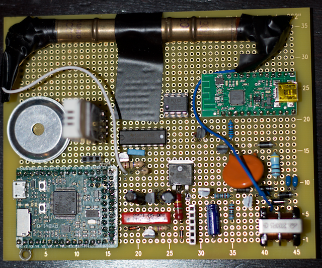

Geiger counter with micropython card
====================================

Hardware Design
---------------

Geiger tube SBM-20:
[http://www.gstube.com/data/2398](http://www.gstube.com/data/2398)/

Pyboard: [http://micropython.org](http://micropython.org)

High voltage generator from
[http://www.mare.ee/indrek/geiger](http://www.mare.ee/indrek/geiger)/

Digitization of tube discharges from
[http://www.techlib.com/science/geiger.html](http://www.techlib.com/science/geiger.html)
(with one gate of 4093 and 3.3V supply)

Power supply from
[http://1wt.eu/articles/alix-ups](http://1wt.eu/articles/alix-ups) and
[http://www.mouser.com/ds/2/268/22008a-53656.pdf](http://www.mouser.com/ds/2/268/22008a-53656.pdf)

Wireless serial port with wixel:
[http://www.pololu.com/docs/0J46/all](http://www.pololu.com/docs/0J46/all)

Log device: fram
[http://www.cypress.com/?docID=50514](http://www.cypress.com/?docID=50514)

Temp & humidity sensor am2302:
[https://www.sparkfun.com/datasheets/Sensors/Temperature/DHT22.pdf](https://www.sparkfun.com/datasheets/Sensors/Temperature/DHT22.pdf)

Buzzer: ZX-27T6A1 at [http://dx.com](http://dx.com)

Micropython card pins used:

    Y12    IN/OUT AM2302
    Y10    IN     TIM2_CH4  GEIGER
    Y2     IN Rx    POLOLOU
    Y11    OUT    Power POLOLOU
    GND    GND
    VDD    VDD    3.3V
    Y3     OUT    SCK FRAM
    Y4     OUT    CS  FRAM
    Y5     OUT    SI  FRAM
    Y6     IN     SO  FRAM
    Y8     OUT    BUZZER
    Y9     OUT    RELAY
    Y1     OUT Tx POLOLOU
    X3     FREE   For testing
    X4     FREE   For testing
    X5     FREE   For testing

Software Design
---------------

Buzzer is activated with programming PWM signal at 3.5Khz. 

AM2302 is one wire, Pin has to be changed from output to input. 

fram has an SPI interface. It is harcoded in python as individual pins. 

The core is the interrupt handler awaken by the discharges of the tube.
